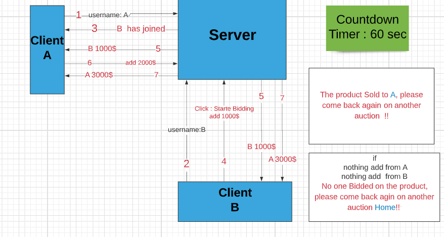

# RealTime
* RealTime Action built with ``node.js`` and ``soket.io``

## Authors
* [NihadZeidan](https://github.com/NihadZeidan)  , [Mohammad Azzam](https://github.com/MohdAzzam)  , [zakeyah](https://github.com/zakeyah) ,  [Ghofran Dayyat](https://github.com/GhofranDayyat) 

## Links
* [GitHub](https://github.com/NihadZeidan/RealTime)
* [Heroku](https://auction-real-time.herokuapp.com/)

## Features 
1. create new Auction room
2. starting and stopping Auction 
3. Multiple user can join auction using username 
4. Sold for last bidding within countdown timer 60 sec

## Running 
* ``npm init -y``
* ``npm i express socket.io-client socket.io``
* [locally](http://localhost:3000)
* [Remotly](https://auction-real-time.herokuapp.com/)

## UML 

##